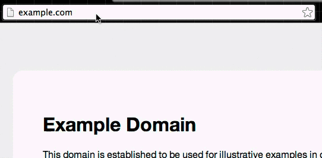

## How to turn a screencast movie file into an animated GIF

This is a quickie walkthrough on how to take a `.mov` file (e.g. Apple QuickTime format) and turn it into an animated GIF. The hypothetical use case is:

1. You've created a narrated screencast, such as a tutorial on how to use a web browser.
2. You want to provide an accompanying _write-up_ for people (and search-engines) who prefer to peruse the content of the tutorial, rather than watch the whole thing in a linear sequence. And also, you want your written tutorial to show certain excerpts from your video, without having to re-record those bits specifically.

> Note: I realize the irony of a text-only walkthrough to explain the process of creating a visual explainer, but I'll spiffy this up some other time. Ping the author, Dan Nguyen, at [@dancow](//twitter.com/dancow)

Here's the big picture of what we'll do:

1. Make a `.mov` file (e.g. a QuickTime movie)
2. Slice it up into many image files, one for each animation frame.
3. Collect all those image files and stuff them into an animated GIF

A movie's animation is, after all, [just an optical illusion caused by flipping through a bunch of still images](http://en.wikipedia.org/wiki/Film_frame).

Instead of doing this conversion via a clunky point-and-click program or web-app, we'll take this as an opportunity to jump into the __command line__ for more complete, concise control.

### Thoughts

1. __Why GIFs?__
  In theory, there's no reason why your written tutorial can't be interspersed with mini-video-clips, cut from the main reel. However, GIFs are simply more __portable__ than video. You can paste them into any old webpage and not have to worry if it supports HTML5 playback. It just _works_...because it is such an old technology. Also, for animated-visuals that show a lot of text (such as a screencast on how to use a spreadsheet), GIFs will typically render text more crisply.

2. __Why the command-line?__ 
   The steps in this tutorial are short and simple (and two of them involve just changing directories)...but if you've never used the command-line before, this may seem like a lot more work than just uploading to a web-service [or using Licecap](http://www.cockos.com/licecap/).

   Ignoring the specific tradeoffs in using those services, the command-line simply promises more _flexibility_ and _power_ in the medium-to-long term. Being able to create animated GIFs, via the process documented here, is simply a result of combining two very useful programs. So while the command line may be harder to learn, _initially_, it will be by far the best investment in time, if you want to do more aristically/journalistically creative things...at _scale_.

   So if you're new to the command-line, don't see this tutorial as a tutorial on how to create animated GIFs. See it as an introduction to the command-line, and to two very powerful image/video manipulation tools that can be tweaked for all varieties and volumes of data-seeking/art-mashup purposes.

### Software pre-requisites

The process detailed here is for UNIX-like operating systems, e.g. Mac OS X and Linux. We'll be using two popular libraries to do the heavy-lifting:

- [FFmpeg](https://www.ffmpeg.org/) - a complete, cross-platform solution to record, convert and stream audio and video.
- [ImageMagick](http://www.imagemagick.org/) - a software suite to create, edit, compose, or convert bitmap images.

You can install these via your system's package manager.

For example, Ubuntu-flavored Linux:

    $ apt-get install imagemagick ffmpeg

On Mac OS X, make it easy on yourself [by installing Homebrew](http://brew.sh/). Then run:
    
    $ brew install imagemagick ffmpeg

> Note: This tutorial was tested on: 
> - Mac OS X 10.9.3 (Mavericks)
> - ffmpeg-2.2.4
> - imagemagick-6.8.9-1
> 

### Movie-making

You can use pretty much any popular movie-format for this exercise. If you're on a Mac, you'll probably find it easiest to do [create a screencast using the __QuickTime Player__](http://thenextweb.com/apple/2011/01/15/how-to-record-quick-easy-screencast-videos-with-mac-osx/).

Be warned: GIF files can be __massive__. If you run through this exercise on a 10-minute fullscreen video, using the default options (i.e. not downsizing the video or skipping a bunch of frames), you will likely crash your computer. Start with a very small, very short file. Then, as you tinker around with the code, try out bigger files.

For convenience's sake, I've created a short video showing how to create and delete a file via OS X's commandline (yes, exciting, I know). The video file is in the repo. It can also [be downloaded directly via this (temporary) link](//cdn.rawgit.com/dannguyen/screencast-to-gif-tutorial/master/my-screencast.mov).

### Command-line conversion

Here are the quick steps to convert `my-screencast.mov` to `output.gif`. I've inlcuded some steps that satisfy the OCD-file-user in me, by saving temp files in a subdirectory and so forth. I've also inlcuded as few as customization options as possible. This is just a quick and dirty example, you can figure out the tweaks on your own.

##### Step 1. Get with your movie file, via the command-line

Let's go to the directory where `my-screencast.mov` exists via the shell, since that's where we'll be doing most of our work:

OK, so assuming you have a file named `my-screencast.mov` somewhere on your computer, pop open your __shell__ (i.e. the __Terminal.app__ if you're on OSX). Then, `cd` to whatever __directory__ your `my-screencast.mov` file exists.

If you're on a Mac, to make it easy on yourself, just move `my-screencast.mov` (via however you typically move files in your operating system, e.g. __Finder__) into your user __Downloads__ folder.

That way, when you open Terminal, you can just do this:

     $ cd ~/Downloads

##### Step 2. Create a sub-directory to work from

Just so we don't have a messy `Downloads` directory, let's make a sub-directory in which we'll do our movie/GIF-making from:

      $ mkdir my-test

Copy our movie file into this new subdirectory:

      $ cp my-screencast.mov my-test/

Then change to that subdirectory so that we're in same folder as our movie file:

      
      $ cd my-test
      

##### Step 3. Create another subdirectory for all the still-images

In the conersion process, we'll be generating a ton of new still-image files. Rather than crowd our working space with hundreds/thousands of files, let's just make a subdirectory named `frames` to dump things into:

    
    $ mkdir frames    

That's it. **Don't** change into this directory

##### Step 4. Convert a movie into many still-images

We use `ffmpeg` on `my-screencast.mov` to convert `my-screencast.mov` into its many component still-frame image files. 

    $ ffmpeg -i my-screencast.mov -r 1 frames/image.%05d.png

An explanation of the __flags__ are in order here:

- `-i inputfilename.xyz` &ndash; this specifie the __source__'s filename, e.g the movie file
- `-r [SOME INTEGER]` &ndash; for __frames-per-second__, e.g. 20 fps would result in 20 still-images per-second-of-video. If you leave out the `-r` flag, `ffmpeg` will just use the movie-files frame-rate. 
      
  Example: Another way to think of it: _Decreasing_ the number given to `-r` will _decrease_ the number of image files created, and thus, _decrease_ the size of the final animated GIF. 

- The final argument, e.g. `frames/image.%05d.png`, is the _pattern_ that describes the filename for each subsequent image-still (remember, there could be dozens, hundreds, thousads of still-frames from a video). 

  The file extension could've be `gif`  or `jpg` or any other popular image format. It doesn't matter as the `frames/` subdirectory is just a temporary holding place for the image files, which will all eventually be combined into one big GIF.
  

If you list the contents of your `frames` subdirectory, you'll see this:

    $ ls frames
      image.00001.png image.00036.png
      image.00002.png image.00037.png
      image.00003.png image.00038.png
      image.00004.png image.00039.png

##### Step 5. Combine the still-images into an animated GIF

The __ImageMagick__ library gives us the `convert` [command-line-tool](http://www.imagemagick.org/script/convert.php), which does as it says &ndash; takes an _existing_ image file and turns it into _new_ image file. We can even change the file _format_, e.g. from PNG to GIF, simply by specifying the file extensions in the _existing_ and _new_ filenames:

    $ convert existing_image.png new_image.gif

Our specific use-case will look like this:

    $ convert frames/image.*.png output.gif

The wildcard operator, `*`, will pluck all files that look like `frames/image.00WHATEVER.png` and feed them into the `convert` program. Lucky for us, `convert` knows that a glob of files can be turned into a single animated GIF.

And we're done! Here's what my `output.gif` looks like:

### Custom conversions

There are many ways to tinker with the flags for both `convert` and `ffmpeg` to get the quality and filesize that you want. You can get pretty far with the command-line, especially with a little piping, to create animated GIFs with dynamically-delayed and resized frames (e.g. to "pause" or "zoom", even if the original screencast didn't have such transitions), but at some point, you'll probably want to make a nice Ruby/Python/Perl wrapper if you plan on industriously-creating animated-GIF-screencasts or what have you.

Making animated-GIFs is a fun venture. But again, keep your mind open to the potential non-GIF related uses for `ffmpeg` and `convert`. For example, I like converting the output of `ffmpeg` with [Tesseract](https://code.google.com/p/tesseract-ocr/), the command-line optical-character-recognition program, for cases when video clips shots of (legible) documents. Getting comfortable with the command-line allows for limitless custom applications.

Here are some resources for now:

- [How to record quick, easy screencast videos with Mac OSX](http://thenextweb.com/apple/2011/01/15/how-to-record-quick-easy-screencast-videos-with-mac-osx/)
- [How do I convert a video to GIF using ffmpeg, with reasonable quality?](http://superuser.com/questions/556029/how-do-i-convert-a-video-to-gif-using-ffmpeg-with-reasonable-quality)
- [Making Animated GIFs from the Linux Command Line](http://www.leshylabs.com/blog/dev/2013-08-04-Making_Animated_GIFs_from_the_Linux_Command_Line.html) - in this article, the author refers to a Perl-wrapper he uses to conveniently contain all the shell commands in one file.
